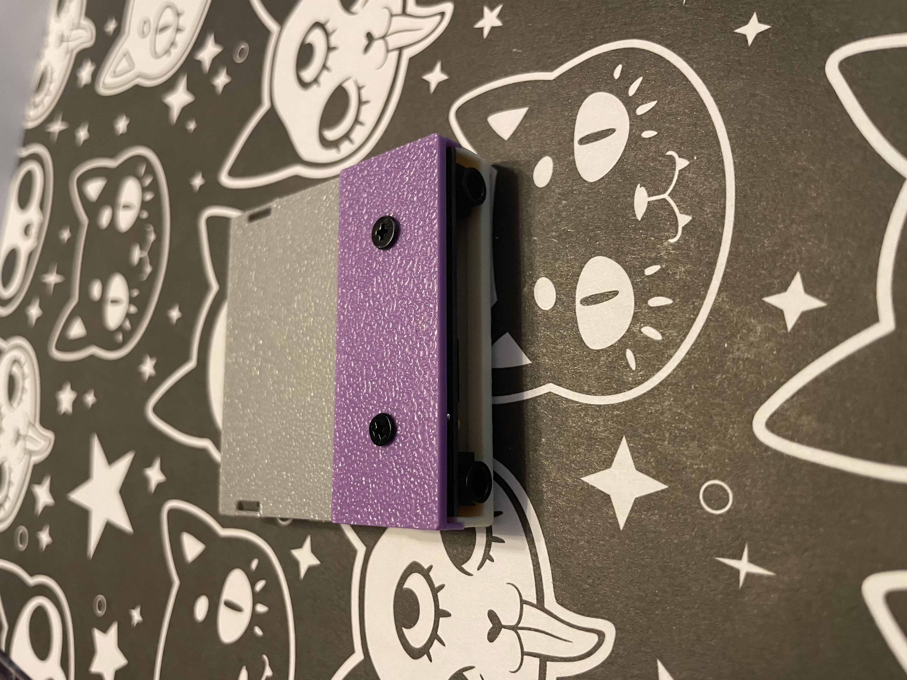
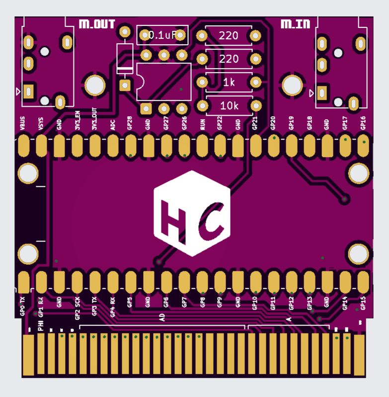
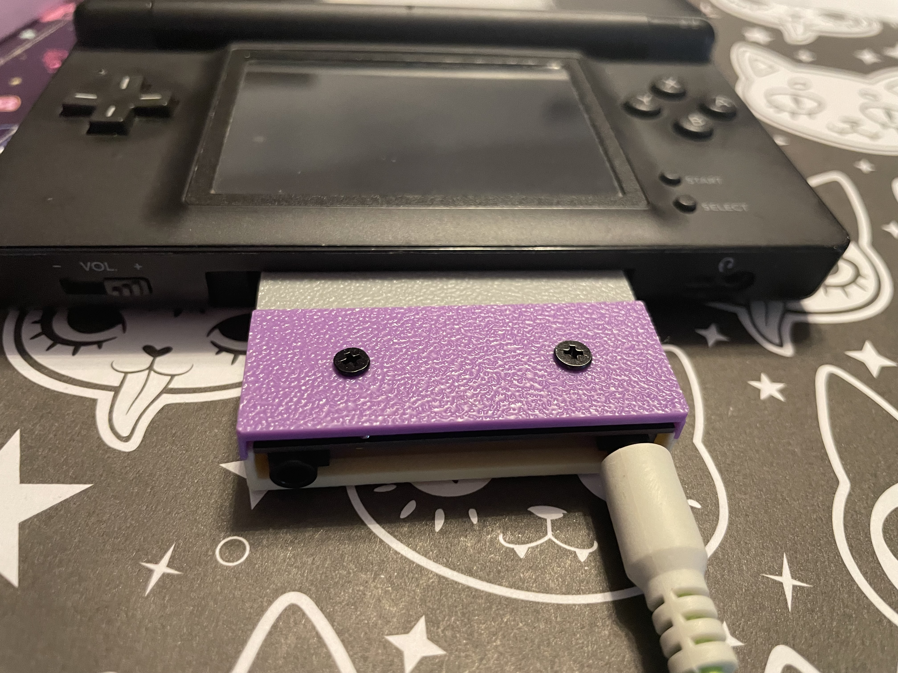

<table>
  <tr>
    <td align="center"><br></td>
    <td align="center"><br></td>
    <td align="center"><br></td>
  </tr>
</table>


# mDS - DS slot-2 MIDI cartridge

**mDS** is a Nintendo DS / DS Lite **slot-2 (GBA Game Pak) MIDI interface**
built on an RP2040. It bridges hardware MIDI into the DS over the slot-2
SRAM bus so a DS app can be a MIDI synth. The DS is the synth; the cart is
the interface - see the [sDS synth app](https://github.com/HobbyChop/sDS), the
baseline ROM that runs on it.

> One firmware, two jobs: mDS speaks the mDS `"STDS"` protocol at **version
> 2** (MIDI clock + a MIDI event ring), so the same cart drives both the
> sDS synth *and* clock-sync apps (e.g. stutter-ds) with no changes.

## Specs

| | |
|---|---|
| **MCU** | RP2040 - dual Cortex-M0+ @ 133 MHz, 264 KB SRAM (Raspberry Pi Pico module, 2 MB flash) |
| **Host interface** | GBA slot-2 SRAM region `0x0A000000`, 4 KB window (12-bit address), serviced by a PIO state machine |
| **MIDI IN** | 31250 baud UART, opto-isolated (6N138 / H11L1) |
| **MIDI OUT** | 31250 baud UART, 2x220 ohm -> TRS/DIN-5 |
| **Indicator** | onboard green LED (GPIO25): status + MIDI activity via PWM |
| **Power** | slot-2 3.3 V rail, no level shifting; 22 uF reservoir cap on VSYS |
| **Programming** | USB BOOTSEL (drag-and-drop UF2); SWD pads optional |
| **Compatibility** | DS / DS Lite only (DSi+ dropped slot-2) |

## Slot-2 bus (pin summary)

In the SRAM region the bus is **not** multiplexed: low address on A0..A11,
data returned on A16..A23 during `/RD`.

| Slot-2 signal | RP2040 GPIO | Dir | Role |
|---|---|---|---|
| A0..A7   | GPIO8..15            | in  | address low |
| A8..A11  | GPIO22, 26, 27, 28   | in  | address high (4 KB window) |
| A16..A23 | GPIO0..7             | out | data bus (driven during `/RD`) |
| /CS2     | GPIO16               | in  | SRAM chip select |
| /RD      | GPIO17               | in  | read strobe |
| /WR      | GPIO18               | in  | write strobe (unused) |
| /IRQ     | GPIO19               | out | optional cart->DS line |
| MIDI TX  | GPIO20               | out | DIN/TRS OUT |
| MIDI RX  | GPIO21               | in  | opto IN |

## Firmware

- **core 1** runs a PIO slot-2 bus servicer (pinned to SRAM for constant-time
  serves): it answers DS reads of the SRAM window from a mirrored state struct,
  and emits MIDI OUT on trigger-reads - fixed transport at `0xE0..0xE3` plus a
  general byte sender at `0xC0..0xDF` (full notes / CC / pitch-bend / etc.).
- **core 0** parses MIDI IN (real-time clock/transport - a clock mirror;
  channel-voice notes/CC - a 16-entry event ring the DS polls) and drives
  the status LED.

### LED

| State | LED |
|---|---|
| powered, alive, no DS reading | dim slow breathe |
| a DS is linked (reading the bus) | steady glow |
| MIDI note/CC arrives | bright flash |
| MIDI clock running (transport play) | heartbeat pulse on the beat |

## Development specification

This is the most technical part of the README: how the cart works under the
hood, and how to talk to it from your own DS program. 

### How the DS and the cart talk

The cart pretends to be a small block of memory that the DS can peek at through
the Game Pak slot - picture a little **notice board**. The cart keeps the board
updated with the latest MIDI info, and the DS just keeps re-reading it.

The catch: on a real DS the slot can be **read but not reliably written**. So
the DS can look at the board, but it can't write a reply back onto it. When the
DS needs to send something *to* the cart, it instead "reads" a few special spots
on the board; the cart notices which spot was read and treats that as a command
- like buttons that do nothing except ring a bell on the cart's side (see
*Outgoing MIDI* below).

> **For programmers:** the board sits at `0x0A000000`. Open the slot with
> `gbacartOpen()` and pick the **slowest** read speed (`GBA_WAIT_SRAM_18`) so the
> cart has time to answer each read (~540 ns). Read **one byte at a time** - a
> wider read just repeats the same byte (a slot quirk). Only the first **256
> bytes** matter; reads past that wrap back to the start.

### What's on the board (layout)

An ID tag so the DS can confirm a real cart is present, some live clock and
tempo info, then a 16-slot **inbox** of recent MIDI messages. Exact layout for
coders:

| Offset | Field | Type | What it is |
|---|---|---|---|
| `0x00` | `magic` | char[4] | the tag `"STDS"` (confirms a real cart) |
| `0x04` | `version` | u8 | protocol version (`2`) |
| `0x05` | `flags` | u8 | bit0 = clock running, bit1 = transport playing |
| `0x06` | `_pad` | u8[2] | spacing |
| `0x08` | `tick_counter` | u32 | MIDI clock tick count (24 per beat) |
| `0x0C` | `bpm_q8` | u32 | tempo in BPM (fixed-point, x256) |
| `0x10` | `micros` | u32 | cart uptime in microseconds (proves it's alive) |
| `0x14` | `song_pos_16ths` | u16 | song position (in 16th notes) |
| `0x16` | `midi_write_head` | u8 | inbox: newest-slot counter (cart writes it) |
| `0x17` | `midi_read_head` | u8 | inbox: DS read position (advisory) |
| `0x18..0x57` | `midi_ring[16]` | 4B ea. | the 16-slot MIDI inbox |
| `0x58..0xFD` | `_reserved` | | unused (reads back 0) |
| `0xC0..0xE3` | doorbell addresses | | reading these sends MIDI out (see below) |

Each value is written by the cart and only read by the DS, so read one field at
a time and you always get a clean value.

### Incoming MIDI: the inbox (cart -> DS)

When MIDI arrives at the cart's IN jack, the cart drops each note or control
change into the next inbox slot and bumps a "newest" counter. The DS watches
that counter and grabs whatever it hasn't seen. The cart always finishes writing
a slot *before* bumping the counter, so the DS never catches a half-written
message. Each slot is 4 bytes:

| Byte | Meaning |
|---|---|
| 0 | message type (high half) + channel (low half) |
| 1 | first data byte (note number / CC number / ...) |
| 2 | second data byte (velocity / value / ...; 0 if unused) |
| 3 | timestamp (low byte of the clock tick) |

(Clock, start, stop, and tempo arrive separately and update the clock/tempo
fields at the top of the board, not the inbox.)

### Outgoing MIDI: the doorbell trick (DS -> cart -> OUT)

Because the DS can't write to the cart, sending MIDI *out* runs in reverse: the
DS **reads** special addresses, and the cart turns each one into a byte sent out
the MIDI OUT jack. The read returns nothing useful (just a zero) - the act of
reading *is* the message. Four addresses are hard-wired to the transport bytes,
and a range lets the DS send *any* byte:

| Read this address | What the cart does |
|---|---|
| `0xE0` / `0xE1` / `0xE2` / `0xE3` | send clock / start / stop / continue (one read each) |
| `0xC0..0xCF` | remember the high half of the next byte |
| `0xD0..0xDF` | send a byte = (that high half) + (this address's low half) |

To send any byte (notes, CC, pitch-bend, anything) the DS splits it into two
halves and reads one address for each: `0xC0 | (B>>4)` then `0xD0 | (B&0xF)`.
It's a little indirect but very fast - about 2 us per byte, far quicker than
MIDI's own wire speed, so nothing backs up. The DS-side helpers do all this for
you: `synth_cart_note_on/off/cc`, `synth_cart_midi_send`, and
`synth_cart_midi_send_byte`.

### Speed and chip layout

The Pico has two CPU cores, split cleanly: **one core does nothing but answer
the DS's reads** the instant they arrive (its code even runs from RAM so nothing
can slow it down), and **the other** handles incoming MIDI and the status light.
It runs at the stock 125 MHz - no overclock, to stay gentle on the slot's power.
MIDI is a slow 1980s standard, and the cart answers reads hundreds of times
faster than MIDI data arrives, so it never struggles to keep up.

### Limits

Great for MIDI and clock, not a channel for bulk data. The link is read-only
(the doorbell trick is the only way back), one byte per read, and 256 bytes of
shared space - plenty for MIDI (which only needs ~3 KB/s), but the hard ceiling
is around 1 MB/s, so it isn't a general-purpose data pipe.

### Writing your own DS program for it

1. Open the slot (`gbacartOpen()`) and set the slow read speed
   (`GBA_WAIT_SRAM_18`).
2. Check the ID tag: `"STDS"` at the start, version `2` right after.
3. Each frame, read the "newest" counter and pull any new inbox messages.
4. To send MIDI out, call the helper functions - and don't read the doorbell
   addresses (`0xC0..0xE3`) by accident, since reading them sends MIDI.
5. Working example: the sDS app.


## Build & flash

Uses the Raspberry Pi Pico SDK. Native (Windows) toolchain recipe:

```
cd rp2040
cmake -S . -B build -G "MinGW Makefiles" -DPICO_BOARD=pico -DPICO_SDK_PATH=C:/pico-sdk
cmake --build build -j
```

(Or `-G "Unix Makefiles"` on Linux/macOS with `PICO_SDK_PATH` exported.)
Output: **`build/mDS_v12.uf2`** (the artifact name is versioned via the target's
`OUTPUT_NAME` in `CMakeLists.txt`). Hold **BOOTSEL**, plug USB, copy the UF2
onto the `RPI-RP2` drive.

## License

Licensed under **[CC BY-NC-SA 4.0](../LICENSE)** (Attribution-NonCommercial-
ShareAlike). You may build, modify, and share your own mDS for
**non-commercial** use, with attribution and under the same license;
**selling mDS units or derivatives is not permitted**.

**Intent:** use the mDS however you like, including to make and **sell
music** (the license does not cover what you create with it). The
restriction is only on dealing in the device/design itself: no selling
mDS units or kits, no manufacturing for sale, no selling modified
firmware/hardware.

The "mDS" / "sDS" names are reserved by the author (trademark is separate
from this copyright license). For commercial use, contact the author.
